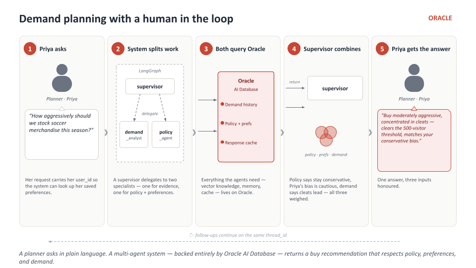
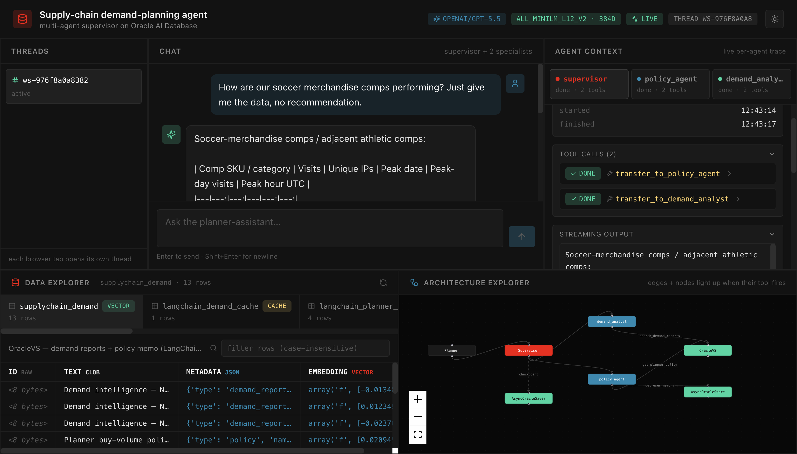
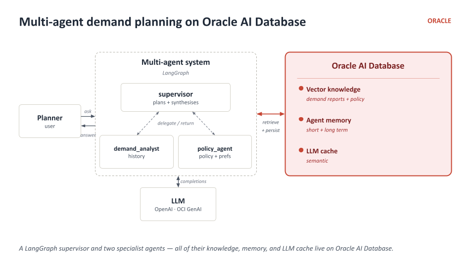
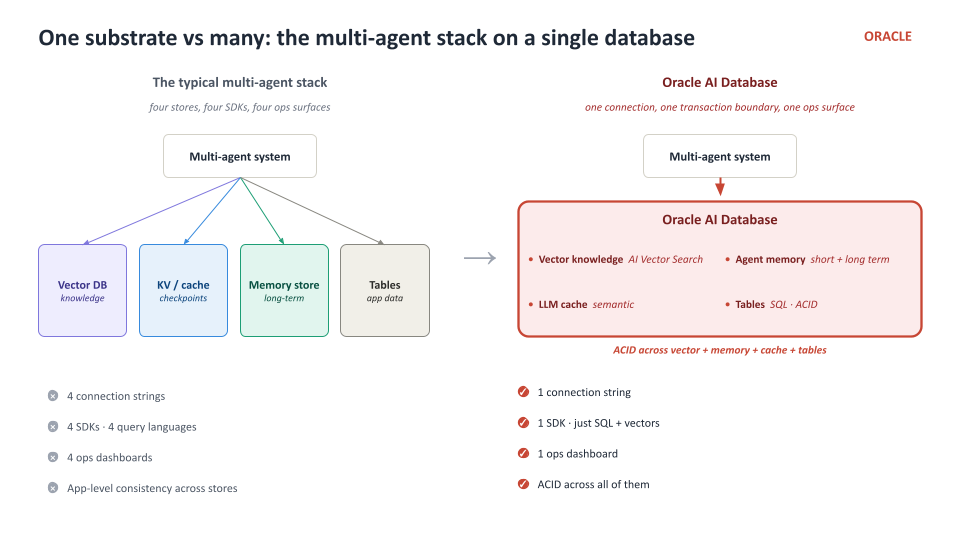

# Supply-Chain Demand Planning Agent Workshop

**Build a multi-agent demand-planning assistant on Oracle AI Database — every memory layer, every retrieval primitive, every LLM call traced back to one database. Then see it running in a real chat UI.**

[](https://codespaces.new/your-org/supplychain-demand-agent-workshop)



---

## What you will build (and run)

> **From notebook concept to running application.** You wire the supervisor + two specialists in the notebook, primitive by primitive. The Codespace already has the *same* multi-agent system running as a chat app on the *same* Oracle — open it on port 3000 and watch the concept you're coding become a live product. The notebook teaches the pattern; the app shows it deployed.

This workshop is two halves of the same thing:

1. **The notebook** (`workshop/notebook_student.ipynb`) — you build a supervisor-coordinated multi-agent system from primitives:
   - In-database ONNX embeddings (`ALL_MINILM_L12_V2`, 384-dim) — no external embedding API.
   - `OracleVS` vector knowledge base of historical product demand reports + a standing buy-volume policy.
   - `AsyncOracleStore` long-term, cross-thread memory for per-planner saved preferences.
   - `AsyncOracleSaver` per-thread checkpoint state.
   - `OracleSemanticCache` LLM-response cache (demoed standalone).
   - Two specialist agents (`demand_analyst`, `policy_agent`) compiled with `langchain.agents.create_agent`.
   - A `langgraph_supervisor` supervisor that decomposes planner requests, delegates to specialists, and synthesises a buy recommendation that respects both the standing policy and the active planner's saved preferences.
   - **9 focused coding TODOs across 12 parts**, ~60–75 minutes.

2. **The app** (`app/`) — a reference deployment of the *same* multi-agent system against the *same* Oracle. Chat pane on the left, per-agent context window pane on the right showing what each specialist saw and produced, real-time architecture explorer at the bottom showing tool calls and hand-offs as they happen. The Codespace boots the app for you on first launch.



> The whole supervisor + 2 specialists loop is roughly 150 lines of Python; the rest is database primitives.

## Architecture at a glance



A LangGraph supervisor and two specialist agents — all of their knowledge, memory, and LLM cache live on Oracle AI Database. No second store, no second connection string, no second consistency model.



## Provider-neutral LLM

The chat model is provider-aware via `LLM_PROVIDER`. Both endpoints speak the OpenAI wire protocol, so the same `ChatOpenAI` client works in both modes:

| `LLM_PROVIDER` | What it means | Required env vars |
|---|---|---|
| `openai` (default) | Call OpenAI directly | `OPENAI_API_KEY`, optional `LLM_MODEL` (default `gpt-5.5`) |
| `oci` | Point the OpenAI client at OCI GenAI's OpenAI-compatible endpoint | `OCI_GENAI_API_KEY`, `OCI_GENAI_ENDPOINT` (defaulted to Phoenix), `LLM_MODEL` (default `xai.grok-4-1-fast-reasoning`) |

Embeddings are **always in-database** (Oracle ONNX) — no external embedding key required.

## Pre-built in the Codespace (so the notebook can stay focused on agents)

Every "true setup" step runs in the Codespace **before** you open the notebook (`app/scripts/bootstrap.py`, `app/scripts/onnx_setup.py`, `app/scripts/seed_supplychain.py`):

- `AGENT` user with vector memory pool.
- `ALL_MINILM_L12_V2` ONNX model loaded into Oracle (in-DB embeddings).
- `harisss/Supplychain` Hugging Face dataset downloaded, aggregated into top-12 product demand reports + a standing buy-volume policy, written into `OracleVS`.
- Two planner-scoped preferences (Priya = conservative, Michael = aggressive) seeded into `AsyncOracleStore`.

The notebook **verifies** all of this is in place, then walks you through wiring the agents that consume it.

## Learning path

| Step | What you do | Where |
|---|---|---|
| 1 | Wait for the Codespace to finish auto-bootstrapping (Oracle, ONNX model, supply-chain seed, app) | Codespace terminal |
| 2 | Open `workshop/notebook_student.ipynb` | Notebook |
| 3 | Work through TODOs 1–9 — each has a hard-stop assert below it | Notebook |
| 4 | Open the running chat UI on port 3000 | Browser preview |
| 5 | Try the starter prompts — every primitive you just wired is live in the app | Browser preview |

## Workshop parts

| Part | Topic | Guide | Coding TODO? |
|---|---|---|---|
| 1 | Setup & connectivity | [docs/part-1-setup.md](docs/part-1-setup.md) | — |
| 2 | In-DB embeddings (`OracleEmbeddings` + `ALL_MINILM_L12_V2`) | [docs/part-2-embeddings.md](docs/part-2-embeddings.md) | **TODO 1** |
| 3 | `OracleVS` — vector knowledge base | [docs/part-3-vector-store.md](docs/part-3-vector-store.md) | **TODO 2** |
| 4 | `AsyncOracleStore` — long-term cross-thread memory | [docs/part-4-store.md](docs/part-4-store.md) | **TODO 3** |
| 5 | `AsyncOracleSaver` — per-thread checkpoints | [docs/part-5-saver.md](docs/part-5-saver.md) | **TODO 4** |
| 6 | `OracleSemanticCache` | [docs/part-6-cache.md](docs/part-6-cache.md) | **TODO 5** |
| 7 | Naive substring vs semantic vector search | [docs/part-7-search-comparison.md](docs/part-7-search-comparison.md) | **TODO 6** |
| 8 | `demand_analyst` specialist | [docs/part-8-demand-analyst.md](docs/part-8-demand-analyst.md) | **TODO 7** |
| 9 | `policy_agent` specialist | [docs/part-9-policy-agent.md](docs/part-9-policy-agent.md) | **TODO 8** |
| 10 | Supervisor + end-to-end invocation | [docs/part-10-supervisor.md](docs/part-10-supervisor.md) | **TODO 9** |
| 11 | `OracleChatMessageHistory` standalone | [docs/part-11-chat-history.md](docs/part-11-chat-history.md) | — |
| 12 | Teardown | — | — |

> **[TODO checklist](docs/TODO-checklist.md)** — 9 coding TODOs at a glance, each with a hard-stop assert checkpoint.
>
> **[Troubleshooting](docs/troubleshooting.md)** — common failures and fixes.

## Notebook pair

| Notebook | When to open |
|---|---|
| [`workshop/notebook_student.ipynb`](workshop/notebook_student.ipynb) | Your working notebook — 9 blank-stub TODOs + hard-stop asserts that fail loudly until you implement |
| [`workshop/notebook_complete.ipynb`](workshop/notebook_complete.ipynb) | The same 12-part notebook with all 9 TODOs filled in — open when stuck, or as a reference once you've finished |

## Getting started

### Option A — GitHub Codespaces (recommended; app auto-starts)

1. Click **Open in GitHub Codespaces** above.
2. Wait ~5 minutes for the auto-build:
   - `setup_build.sh` — installs notebook + backend + frontend deps.
   - `setup_runtime.sh` — boots Oracle, runs `bootstrap.py` → `onnx_setup.py` → `seed_supplychain.py`.
   - `start_app.sh` — starts the chat app on port 3000.
3. **Open the workshop notebook** when the codespace finishes auto-bootstrapping.
4. Work through TODOs 1–9, each with a hard-stop assert.
5. Open the **app preview** on port 3000 to see the same agents running with a chat UI + live per-agent context window + real-time architecture explorer.

### Option B — Local

You'll need:
- Oracle AI Database (the free container is fine — see `.devcontainer/docker-compose.yml`).
- Python 3.11+, Node 20+.
- An OpenAI API key (or OCI GenAI credentials).

Then:

```bash
bash .devcontainer/setup_build.sh
bash .devcontainer/setup_runtime.sh    # boots Oracle, bootstraps, seeds
bash .devcontainer/start_app.sh        # optional — starts the chat app
jupyter lab workshop/notebook_student.ipynb
```

## Repo layout

```
.devcontainer/
  devcontainer.json          # Codespaces config + post-create/post-start hooks
  setup_build.sh             # one-time pip + npm install
  setup_runtime.sh           # boots Oracle + runs bootstrap.py / onnx_setup.py / seed_supplychain.py
  start_app.sh               # starts the chat app (backend + frontend)
  docker-compose.yml         # Oracle Free image

app/
  scripts/
    bootstrap.py             # AGENT user + vector memory pool
    onnx_setup.py            # downloads + loads ALL_MINILM_L12_V2 ONNX model
    seed_supplychain.py      # HF download + OracleVS seed + AsyncOracleStore seed
  backend/                   # the chat-app backend (FastAPI/Socket.IO)
  frontend/                  # the chat-app frontend (React + Vite)

workshop/
  notebook_student.ipynb     # YOUR working notebook — 9 TODOs + hard-stop asserts
  notebook_complete.ipynb    # solutions filled in (coming next iteration)

docs/                        # part-by-part explanations
```

## Status

| Component | State |
|---|---|
| `workshop/notebook_student.ipynb` | ✅ 61 cells, 9 blank-stub TODOs, 9 hard-stops, in-DB ONNX embeddings |
| `workshop/notebook_complete.ipynb` | ✅ same notebook with all 9 TODOs filled in |
| `docs/` (per-part guides + TODO checklist + troubleshooting) | ✅ 13 markdown files |
| `.devcontainer/` + setup scripts | ✅ lifecycle: build → runtime → start_app |
| `app/scripts/seed_supplychain.py` | ✅ HF download → OracleVS + AsyncOracleStore |
| `app/scripts/bootstrap.py` + `onnx_setup.py` | ✅ AGENT user + vector pool + ONNX model load |
| `app/backend/` (FastAPI + WebSocket + supervisor streaming) | ✅ delivered |
| `app/frontend/` (React + Vite — chat + agent-context tabs + architecture explorer) | ✅ delivered |

